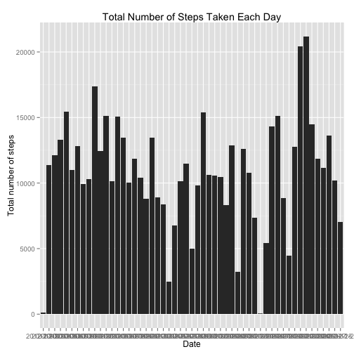
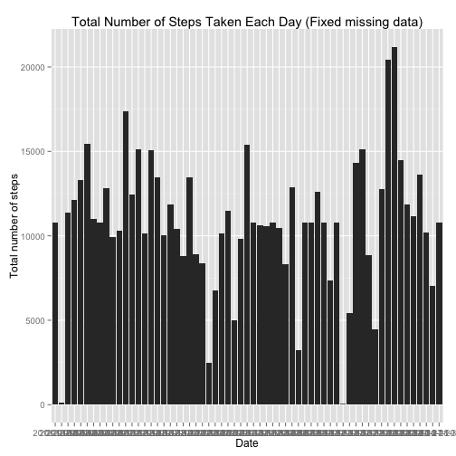
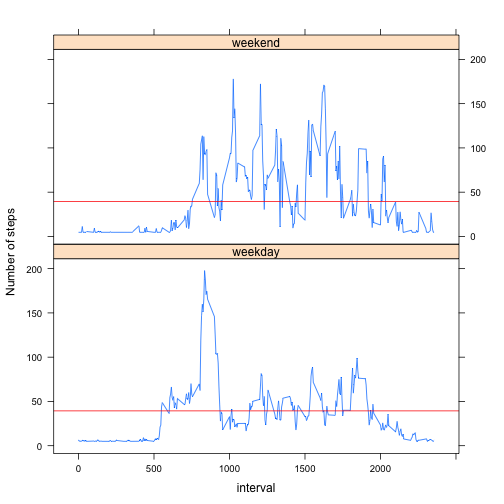

# Reproducible Research: Peer Assessment 1
by **Ray Cai** [kkppccdd@gmail.com](mailto:kkppccdd@gmail.com)

## Abstract
This report answers several descriptive statistical questions according dataset [activity.zip](https://d396qusza40orc.cloudfront.net/repdata%2Fdata%2Factivity.zip).


## Loading and preprocessing the data
Unzip dataset archive and load it as *activities*

```r
activities<-read.csv(unz("activity.zip","activity.csv"),header=TRUE)
```


## What is mean total number of steps taken per day?
Remove all measuremens which contains missing values (NA), then calculate the histogram of the total number of steps taken each day.

```r
cleanedActivities<-activities[!is.na(activities$steps),]
histTotalStepsPerDay<-aggregate(cleanedActivities$steps,by=list(Date=cleanedActivities$date),FUN=sum)
colnames(histTotalStepsPerDay)<-c("date","totalOfSteps")

library(ggplot2)
qplot(histTotalStepsPerDay$date,histTotalStepsPerDay$totalOfSteps,geom="histogram",stat="identity",xlab="Date",ylab="Total number of steps",main="Total Number of Steps Taken Each Day")
```

 

```r
##Calculate the mean and median of total number of steps taken per
meanTotalStepsPerDay<-mean(histTotalStepsPerDay$totalOfSteps,na.rm=TRUE)
medianTotalStepsPerDay<-median(histTotalStepsPerDay$totalOfSteps,na.rm=TRUE)
```

The mean of total number of steps taken per day is 1.0766 &times; 10<sup>4</sup>, and the median of total number of steps taken per day is 10765.

## What is the average daily activity pattern?
Make a time series plot (i.e. type = "l") of the 5-minute interval (x-axis) and the average number of steps taken, averaged across all days (y-axis).

```r
plot(cleanedActivities$steps,type="l",xlab="Time Series",ylab="Number of Steps Taken", main="Time Series of 5-minute Interval")
abline(h=mean(cleanedActivities$steps),col="red")
legend("topright",c("average line"),col=c("red"),lty=(1))
```

 


```r
acrossAverageIntervals<-cleanedActivities[cleanedActivities$steps>mean(cleanedActivities$steps),]
maxInterval<-acrossAverageIntervals[max(acrossAverageIntervals$steps),]
```

The 5-minute interval 

```r
maxInterval
```
contains the maximum number of steps.
## Imputing missing values

```r
numberOfMissingData<-nrow(activities[is.na(activities$steps),])
```
2304 records are missing values in the dataset.

Fill missing data with mean of steps taken in all 5-minute intervals

```r
meanOfStepsPerInterval<-mean(activities$steps,na.rm=TRUE)
fixedActivities<-activities
fixedActivities[is.na(fixedActivities$steps),]$steps<-meanOfStepsPerInterval
```


```r
fixedHistTotalStepsPerDay<-aggregate(fixedActivities$steps,by=list(Date=fixedActivities$date),FUN=sum)
colnames(fixedHistTotalStepsPerDay)<-c("date","totalOfSteps")

qplot(fixedHistTotalStepsPerDay$date,fixedHistTotalStepsPerDay$totalOfSteps,geom="histogram",stat="identity",xlab="Date",ylab="Total number of steps",main="Total Number of Steps Taken Each Day (Fixed missing data)")
```

 

```r
##Calculate the mean and median of total number of steps taken per day
fixedMeanTotalStepsPerDay<-mean(fixedHistTotalStepsPerDay$totalOfSteps,na.rm=TRUE)
fixedMedianTotalStepsPerDay<-median(fixedHistTotalStepsPerDay$totalOfSteps,na.rm=TRUE)
```

Compared the mean and median of cleaned dataset (which ignore measurements which contains missing values) and fixed dataset (which fill missing values by mean), the mean (cleaned dataset:1.0766 &times; 10<sup>4</sup>, fixed dataset:1.0766 &times; 10<sup>4</sup>) of them are same, the median (cleaned dataset:10765, fixed dataset:1.0766 &times; 10<sup>4</sup>) of them are different.

## Are there differences in activity patterns between weekdays and weekends?
For comparing the difference of actitivy patterns between weekdays and weekends, it should remove non-related variables. Therfore I convert variable **date** to **datetype** ("weekday" or "weekend"), and calculate the mean of **number of steps** group by **datetype** and **5-minute interval**

```r
# add factor "datetype"
datetype<-sapply(fixedActivities$date,FUN=function(date){
  if(weekdays(as.Date(date)) == "Sarturday" | weekdays(as.Date(date)) == "Sunday"){
    "weekend"
  }else{
    "weekday"
  }
},simplify=TRUE)
fixedActivities<-cbind(fixedActivities,datetype)

# aggregate by interval,datetype
averageStepsByIntervalDatetype<-aggregate(fixedActivities$steps,by=list(interval=fixedActivities$interval,datetype=fixedActivities$datetype),FUN=mean)

colnames(averageStepsByIntervalDatetype)<-c("interval","datetype","avgSteps")

library(lattice)
xyplot(avgSteps~ interval|datetype,data=averageStepsByIntervalDatetype,xlab="interval",ylab="Number of steps",type="l",layout=c(1,2),panel = function(x, y, ...) {
               panel.xyplot(x, y, ...)
               panel.abline(h=mean(averageStepsByIntervalDatetype$avgSteps),col="red")
             },)
```

 

Sample moves more frequently on weekend than on weekday, and wakeups much later than on weekday. Sample usually wakeup at midday on weekend. In contrast, sample usually wakeup between 9 AM and 10 AM on weekday. Sample sleeps later on weekend than on weekday. A significant difference between weekend and weekday is that there is a significant peak of activity on weekday.
